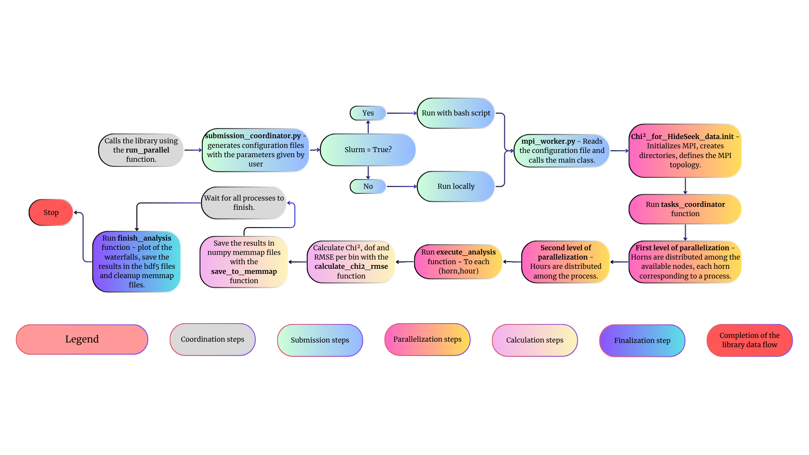
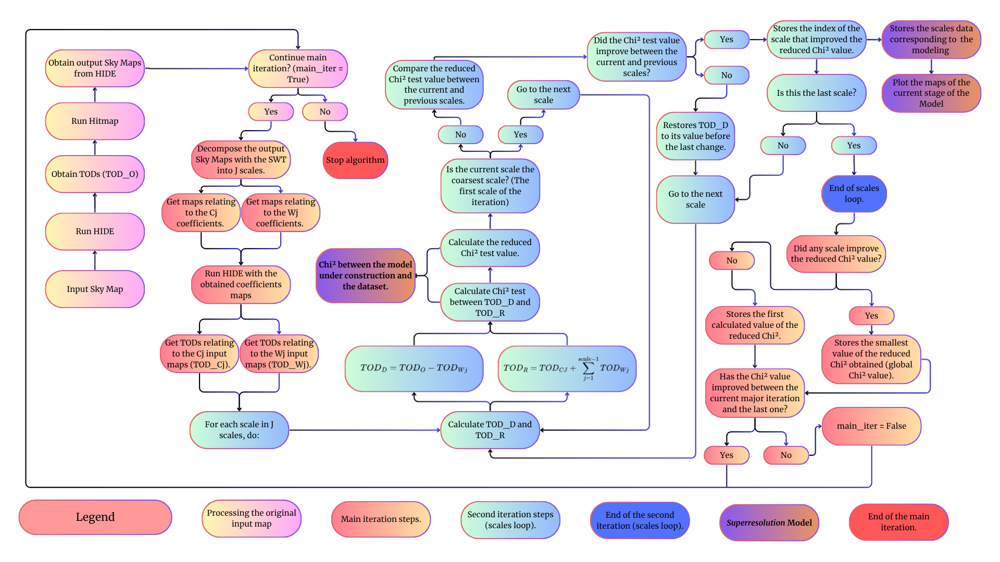

# High_Resolution_Pipeline_for_BINGO

[cite_start]Considering the limited $40^{1}$ (40 arcminute) angular resolution of the BINGO radiotelescope, this project aims to develop a system capable of recovering information from smaller angular-scale structures using an iterative algorithm. [cite: 34]

[cite_start]This algorithm utilizes the following tools (which had to be adapted and/or developed): [cite: 35]

* [cite_start]**HIDE & SEEK** [cite: 36]
  * [cite_start]Adapted for integration times other than 1s [cite: 37]
  * [cite_start]Adapted to work in parallel using Python multiprocessing methods [cite: 38, 39]
  * [cite_start]Repository: https://github.com/zxcorr/hide/tree/HIDE_parallel [cite: 40, 41]

* [cite_start]**Python Library - Chi2 analysis_for HideSeek data** [cite: 42, 43]
  * Two-level parallelization using MPI [cite: 44]
  * [cite_start]Adapted to run on clusters and standard servers [cite: 45]
  * [cite_start]Repository: https://github.com/nickchinchila/Chi2_analysis_for_HideSeek_data [cite: 46, 47, 48, 49]

* **GMCA4im scripts** [cite: 50]
  * [cite_start]Adapted for SWT decomposition at various scales [cite: 51]
  * [cite_start]Parallelized SWT using Python multiprocessing [cite: 52]
  * Adapted for compatibility of output files with H&S [cite: 53]
  * [cite_start]Repository: https://github.com/isab3lla/gmca4im [cite: 54]

---

## [cite_start]3. Library Chi² analysis for HIDE & SEEK data structure [cite: 55]

## [cite_start]4. High Resolution Model Construction Algorithm [cite: 110]

